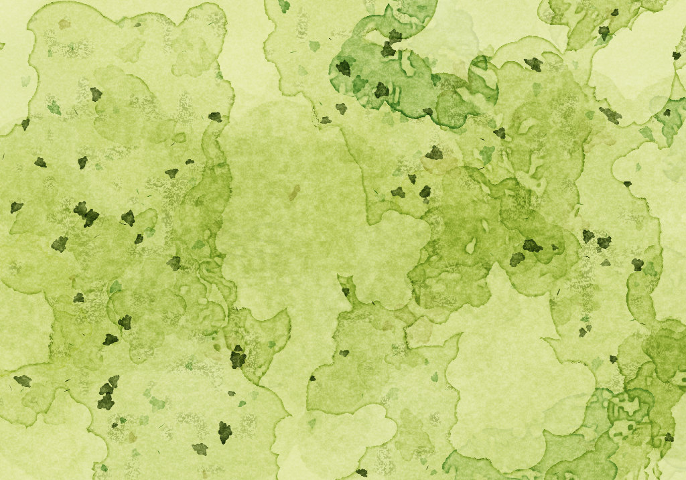
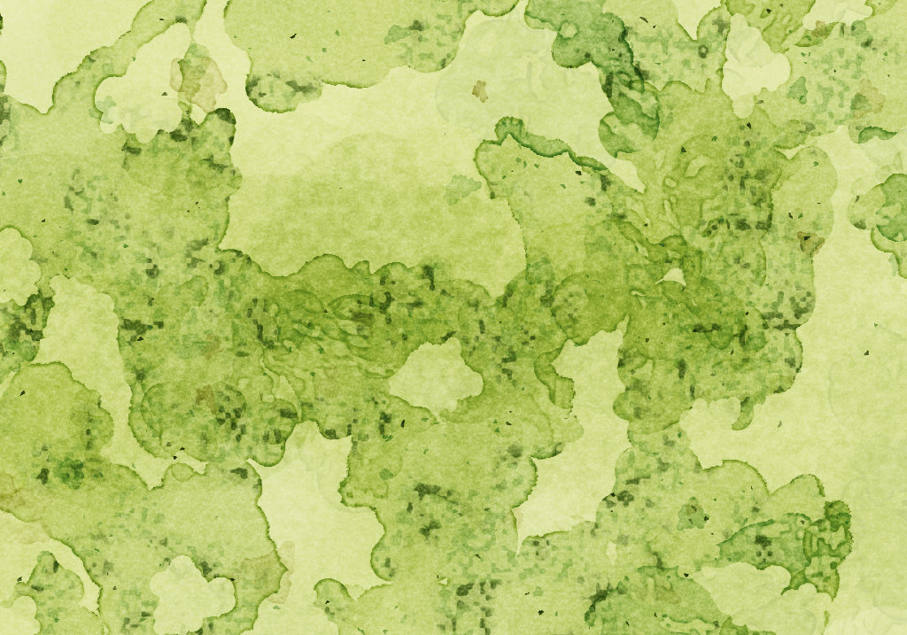
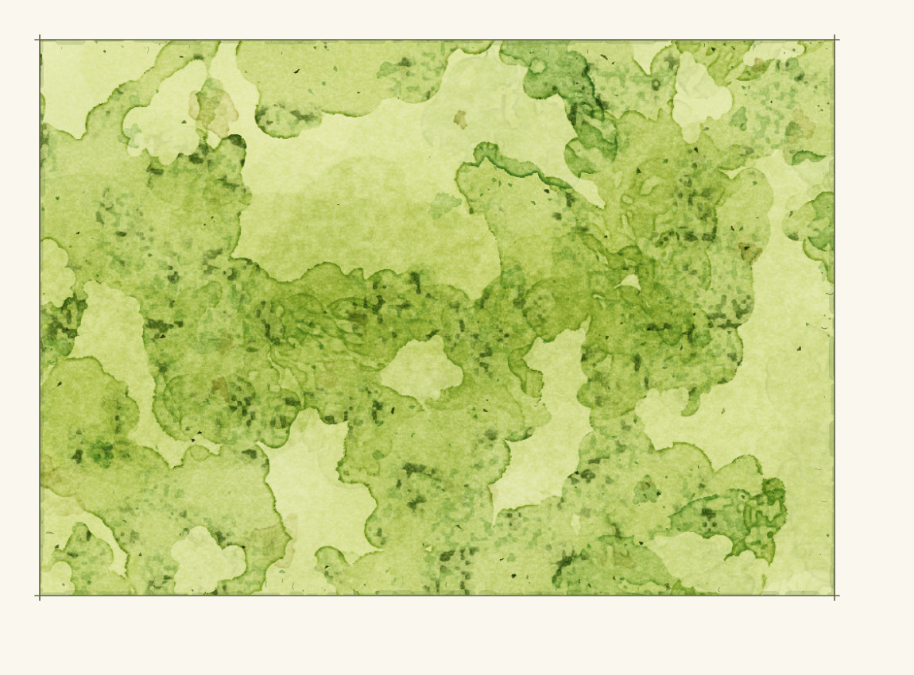
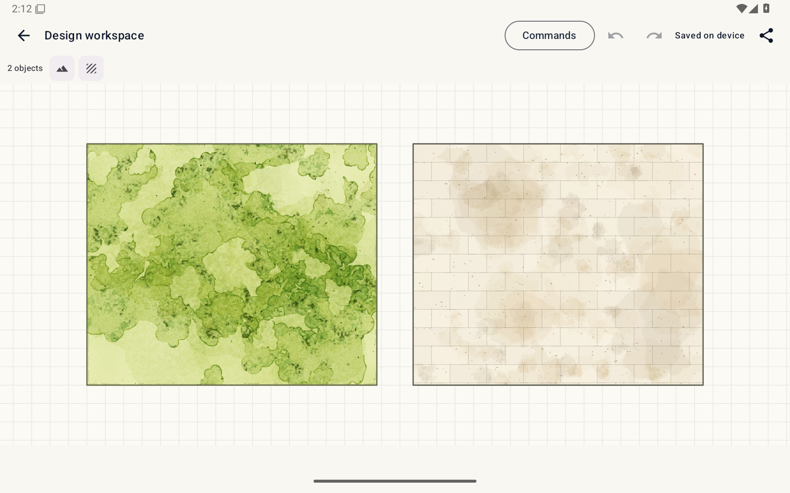
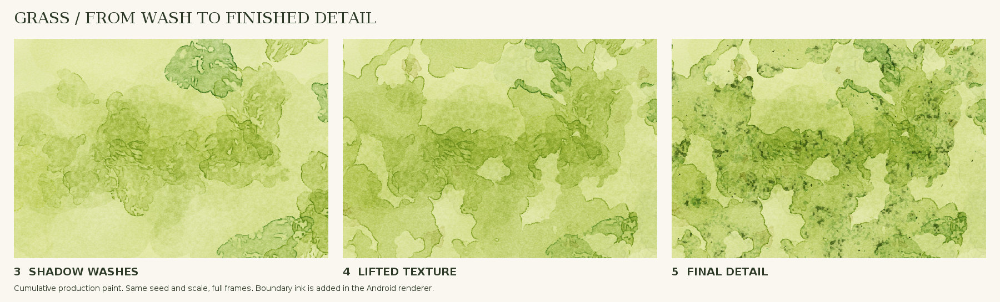

# Android grass: pigment finishing, 2026-09-13

These are production Java paint pixels, not Godot or generated reference art.
The before and after use the same `ground-study` object seed, 1024×717 canvas,
and full uncropped surface. JPEGs are preview copies; the CI report preserves
PNG captures from Android's renderer.

## Before: 5971f8b

## After: df8da14

The first three paint stages are unchanged. Smaller overlapping keep masks and
reserve tongues break up the large cutouts. Spatially varying front strength
reduces continuous pooling rings. Small green/olive-black deposits now belong
to the retained paint and paper instead of large isolated near-black stamps.

## Actual Android renderer

## Live Android workspace

## Cumulative stages 3, 4 and 5

Both the whole field and close crops were inspected for two seeds. Narrow
1024×180 and tall 240×1024 fields were also inspected locally. This is visual
evidence for the paint changes, not a 9/10 score or physical-tablet timing.
Broad pale reserves and some dominant drying fronts remain visible differences
from the designated grass witness. Water, paving and Godot source are unchanged.

All 304 unit tests and 20 emulator scenarios passed at `df8da14`.
Live, exported and reopened grass captures were inspected. These are synthetic
API-35 emulator results. Android build, renderer and emulator results are recorded in
[CURRENT_STATE](../CURRENT_STATE.md). The painter's native Android adapter still
owns clipping, boundary ink, opacity, asynchronous preparation and zoom levels.
