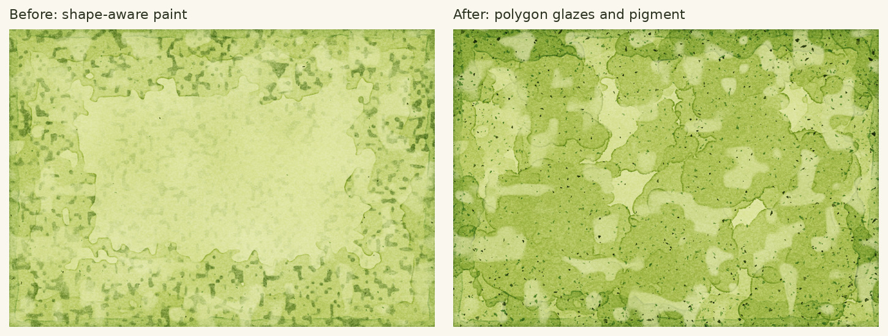
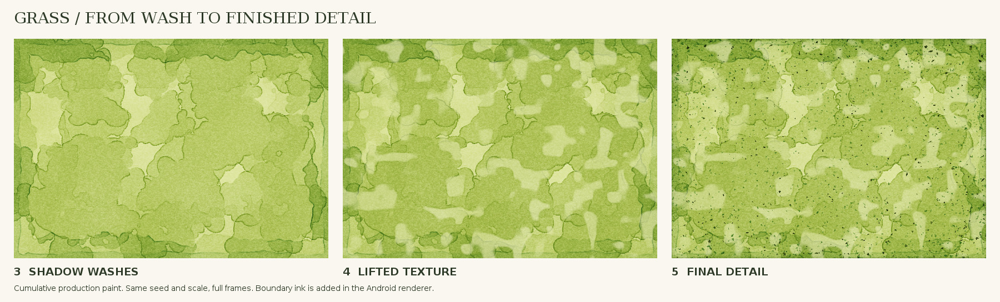
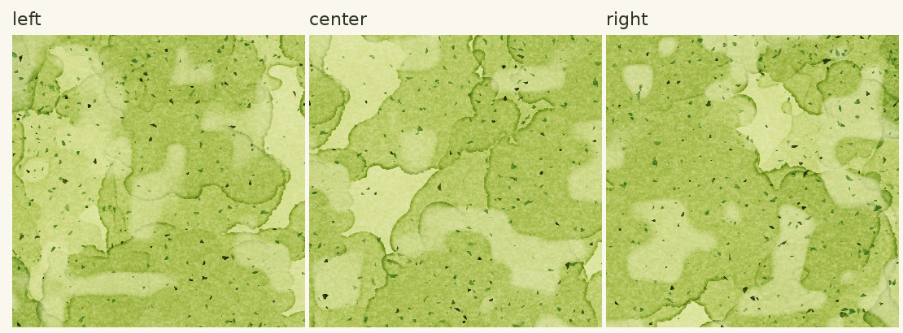
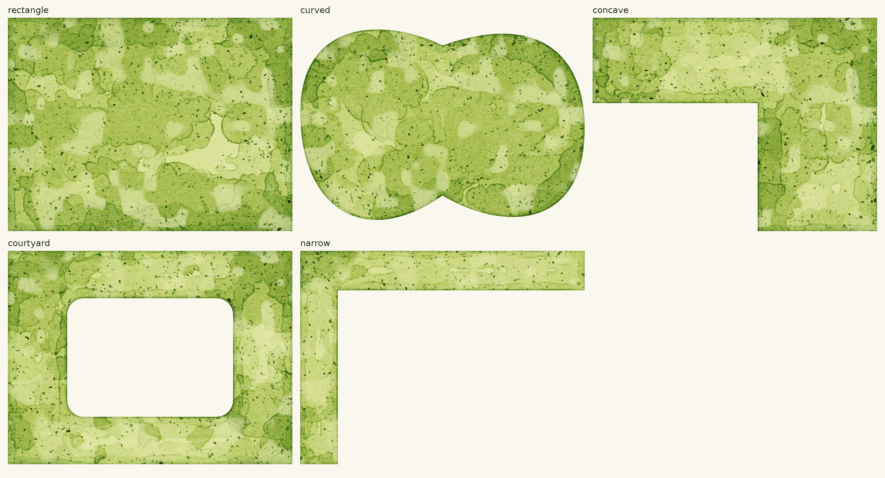
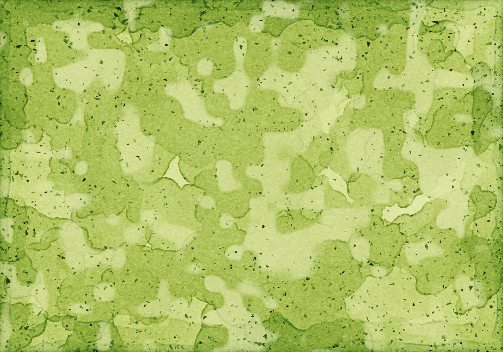
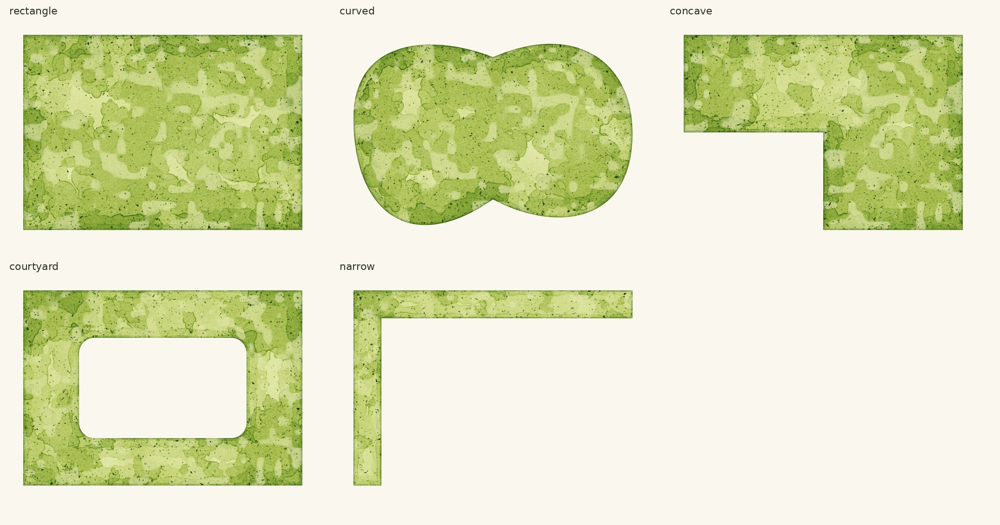
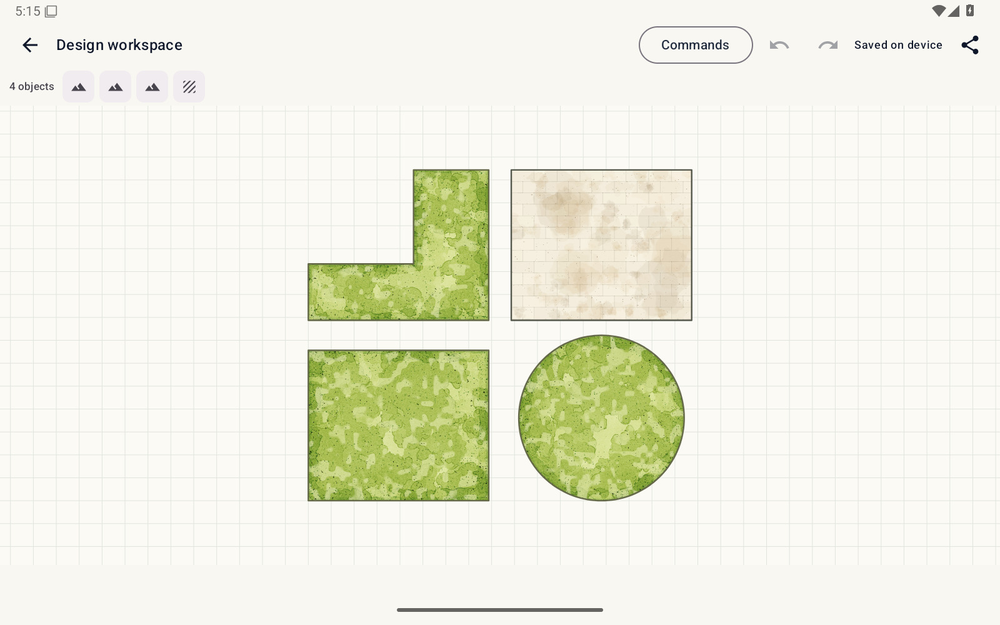
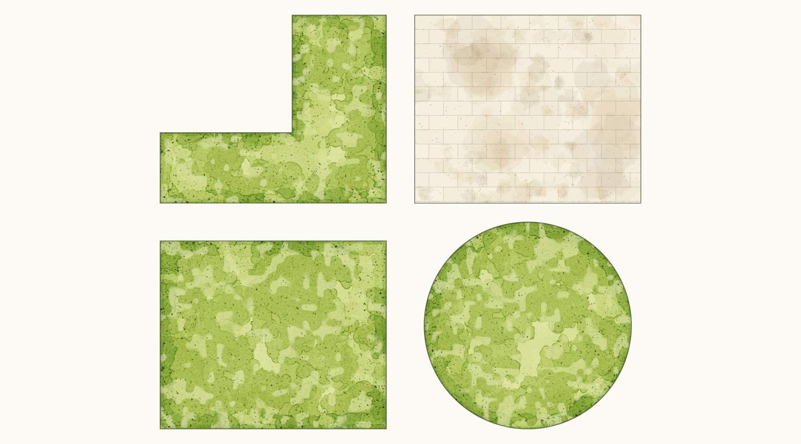
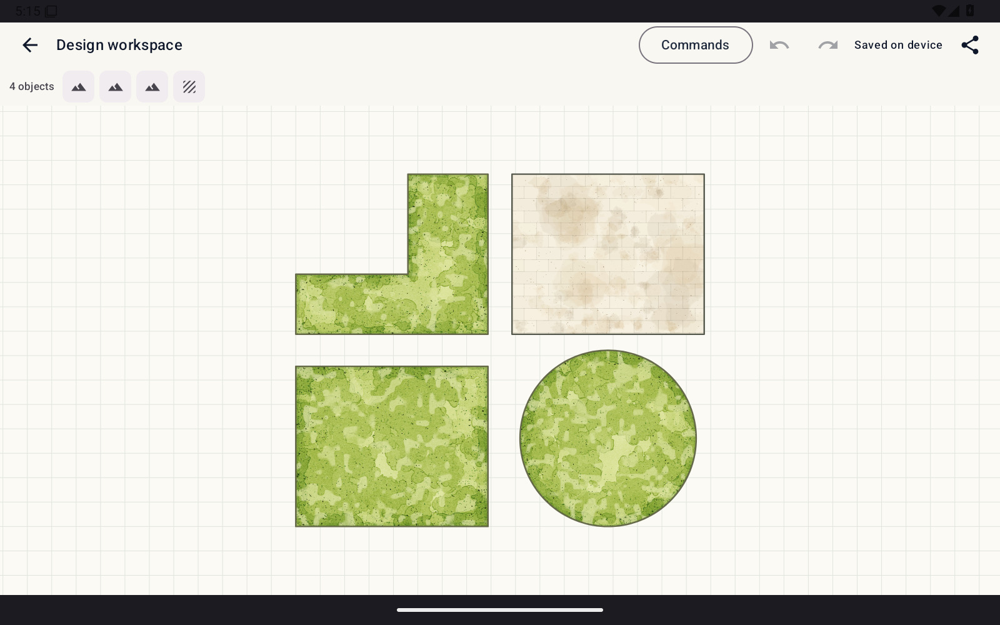

# Android grass: interior washes and pigment finishing

The `northstar-live-rendering-engineer` skill was used to compare the grass
witness with the previous shape-aware painter. The strongest gaps were one
large empty center and small angular marks inherited from a square noise grid.
The [retained witness row](../northstar-study/board-grass-row.jpg) shows translucent
overlap, pale lifted channels, pigment-rich drying fronts and varied fine marks.

## Controlled before and after

Same `ground-study` seed, 1024 × 717 pixels and full rectangular frame.
Before is production app `37ef80e`. After is production app `ca87075`.
The Java inspection adapter calls the production painter directly. Neither
result includes generated imagery or embedded reference pixels.

## Layer construction

The existing boundary-distance and local-width fields still guide paint.
Recursive polygon glazes now cross the middle; their scale narrows in thin arms.
A green glaze accumulates where those forms meet a boundary wash. Lifting exposes
the earlier underpainting. Finishing uses deformed polygon deposits and fine
strokes, with size, pigment loading and placement density varying by the wash
and distance from the actual boundary. The grid-threshold finishing pass is gone.

The first iteration spread too many speckles across the interior. The second
increased edge weighting. The third strengthened overlapping glazes to improve
value grouping. A fourth strengthened the texture glaze after the stage
operation check found too little repainting. Lift, repaint and dark-tail
checks now pass locally with unchanged thresholds. The existing RGB Kubelka-Munk layering and mass-conserving drying
operator are unchanged. This remains an artistic approximation of paint.

## Shape and seed matrix

Five full shapes share the `shape-study` seed. A second rectangular seed,
`neighbor`, checks that the result is not a specially selected single sample.

## Host paint-generation cost

The [timing adapter](../../tools/qa/GrassPaintTiming.java) loaded the previous and
current production cores in separate class loaders in one Java 17 process with
`-Xmx384m`. Each rendered a fresh 1024 × 717 `ground-study` surface after one
warmup. Three measured calls produced identical pixels within each version.
No image encoding or Android bitmap cache is included.

| Revision | Samples, milliseconds | Median |
| --- | --- | --- |
| `37ef80e` | 793.7, 709.4, 768.3 | 768.3 ms |
| `ca87075` | 1074.0, 1024.8, 1036.6 | 1036.6 ms |

The extra glazes and explicit deposits cost about 35% more uncached generation
in this small host experiment. Cached redraw is unchanged in source. These are
not Android frame-time, tablet latency or cold-start measurements.

## Validation and limits

Local compilation targets Java 11. App revision `ca87075` passed all **306 unit
tests**, nine runtime-policy checks and debug assembly in
[Android integrity run 34739346080](https://github.com/CRisdon45/Plan_Trace/actions/runs/34739346080).
Downloaded XML confirms zero failures/errors/skips. Test thresholds are unchanged.
Native Android stage images match the local production-core study pixel-for-pixel.
Water and paving detail PNGs remain byte-identical. Shape edits, translation,
opacity, cache eviction, pan/zoom and serialization checks pass.

The following full-frame images came from the production Android Path adapter
under Robolectric native graphics. All five were opened and inspected.

[Android workspace run 34739346081](https://github.com/CRisdon45/Plan_Trace/actions/runs/34739346081)
passed **all 20 scenarios** at `ca87075`. Downloaded logs independently confirm
20 passes. The live canvas, exported PNG and reopened workspace were opened and
inspected. Active-window records identify the development app. Crash output is
empty and no ANR occurred. Appearance switching preserves saved project JSON
byte-for-byte. Artifact and original PNG hashes are in [CURRENT_STATE](../CURRENT_STATE.md).

These are JPEG viewing copies of the original PNG evidence. No recoloring,
texture replacement, selective cropping or image generation was applied.
 The production Java painter is the only changed application file.
Semantic geometry, path clipping, cache key, worker, bitmap budget and exports
remain owned by their existing Android components.

Some large wash contours still look too rounded compared with the reference,
and the variation in fine marks can still improve. This is not a 9/10 acceptance
claim. Physical-tablet frame-time and pen-latency measurements are unavailable.
