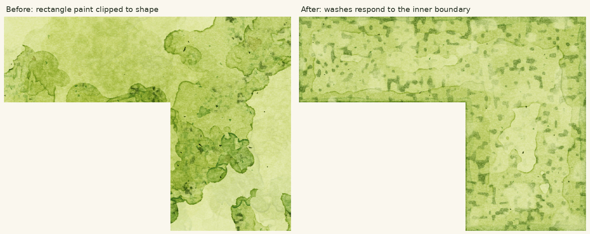
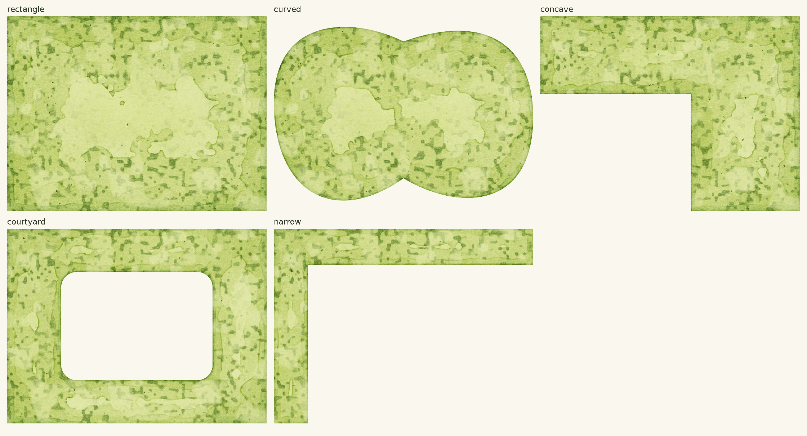
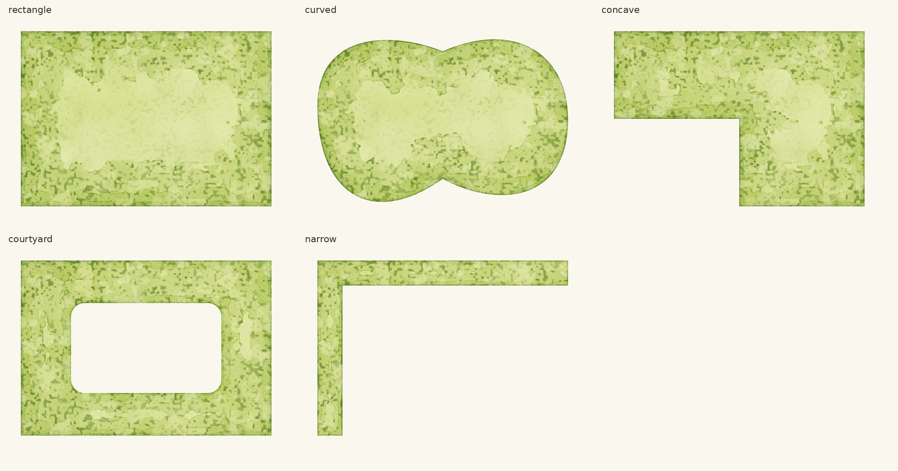
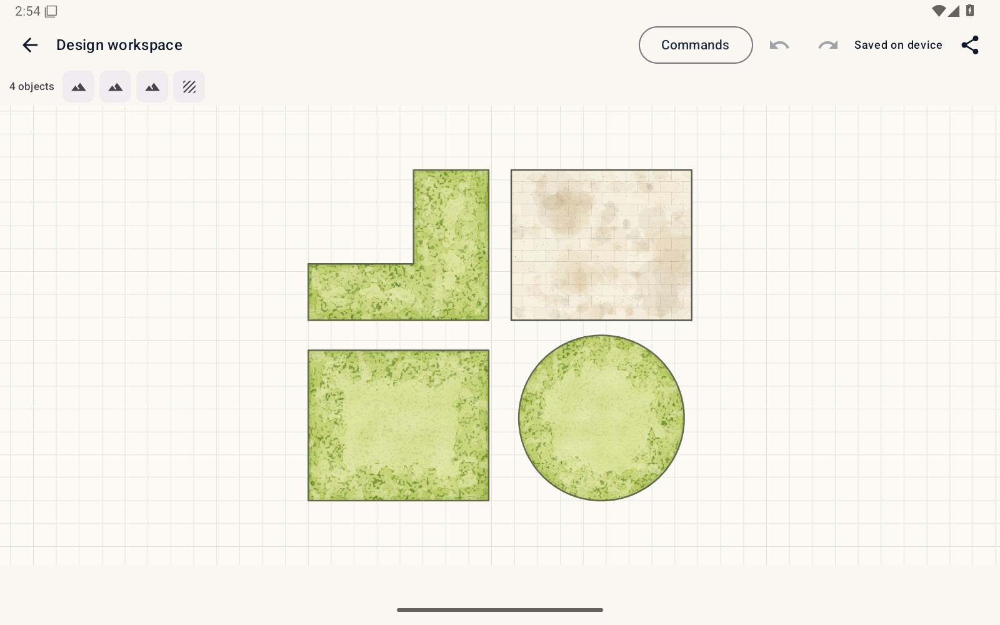
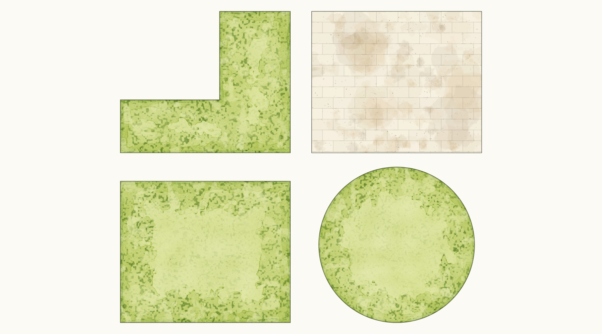
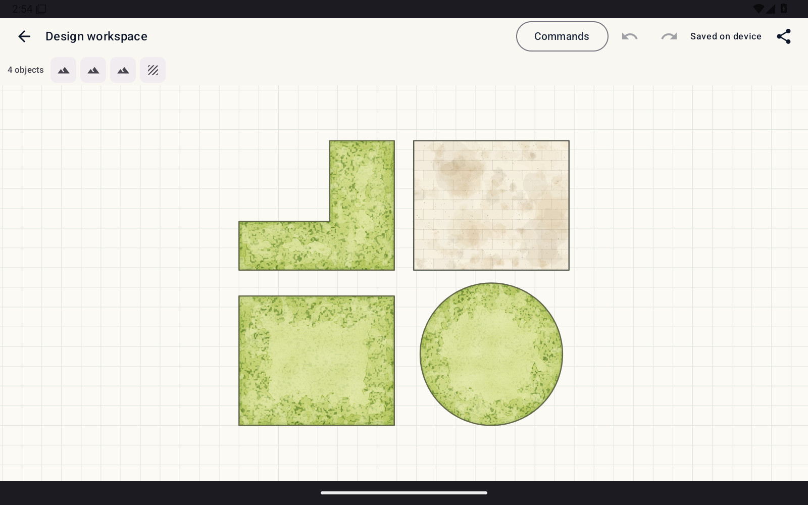

# Android grass: shape intent

The production Android painter now derives its washes from actual path coverage.
Darker deposits follow outer edges, concave returns and courtyard openings;
wash widths shrink through narrow arms. A same-bounds outline edit now changes
the paint cache key. Translation and view zoom retain the object-local result.

## Controlled before/after

Same seed, dimensions and concave mask. Left uses the prior production painter
at `df8da14`, clipped to the shape. Right uses the shape-aware production core
at `37ef80e`. Both are full-frame Java studies; AWT supplies only the test mask.
No generated image or reference pixels are part of either render.

## Five production-core shapes

Rectangle, freeform curve, concave return, courtyard opening and narrow turn.
All share the same seed. This makes the effect of geometry directly visible.
The Android adapter supplies its own native Path coverage in the app.

## Native Android render evidence

These are full-frame captures from the production Android Path adapter under
Robolectric native graphics, not the AWT study. API 35 tests use identical
bounds and object IDs so geometry is the changing input. All five were opened
and inspected. Insets and the paper background are retained.

App revision `37ef80e` passed all 306 unit tests and nine runtime-policy checks
in [Android integrity run 34733651532](https://github.com/CRisdon45/Plan_Trace/actions/runs/34733651532).
The same-bounds test checks pigment redistribution near the new inner boundary,
not only a cache miss. Existing pan/zoom, translation, opacity, eviction and
serialization checks also pass. Water and paving detail PNGs are byte-identical
to the previous verified build. Artifact hashes are in [CURRENT_STATE](../CURRENT_STATE.md).

## Live Android workspace and export

[Android workspace run 34733651547](https://github.com/CRisdon45/Plan_Trace/actions/runs/34733651547)
passed all 20 scenarios at the same app revision. The actual workspace fixture
contains rectangular, circular and concave lawns alongside unchanged paving.
Live, exported and reopened images were opened and inspected. Active-window
records identify the development app; crash output is empty and no ANR occurred.
Appearance changes preserve saved project JSON byte-for-byte.

These are JPEG viewing copies of the original PNG captures. No image-generation
tool, texture replacement, recoloring or selective crop was used. Original
artifact and PNG-export hashes are in CURRENT_STATE.

## Limits of this revision

Geometry now directs the wash distribution, but the fine dark accents still
have some regularity and the pale centers remain broad. This is not a declared
9/10 match. The mechanism is an artistic approximation using distance fields,
local width, existing pigment layering and drying; it does not infer sun or
planting adjacency. Physical-tablet frame times remain unmeasured.
