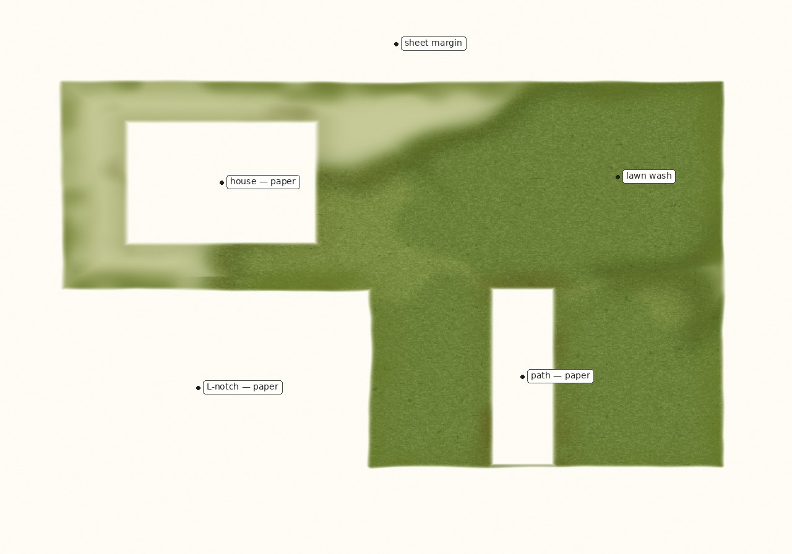
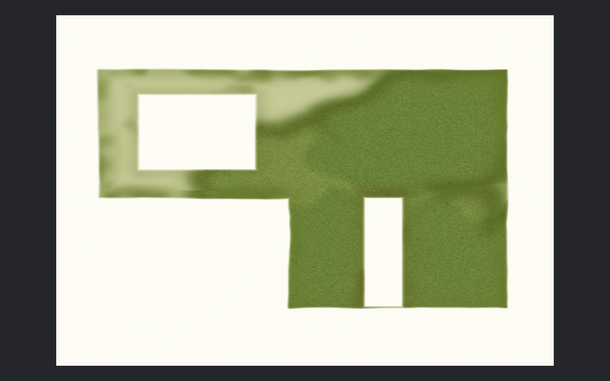
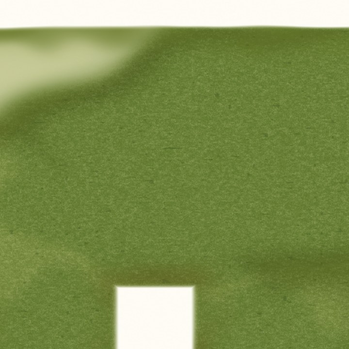
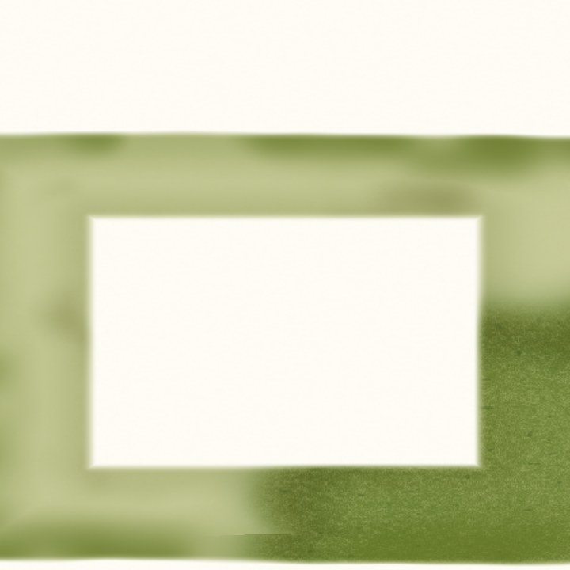
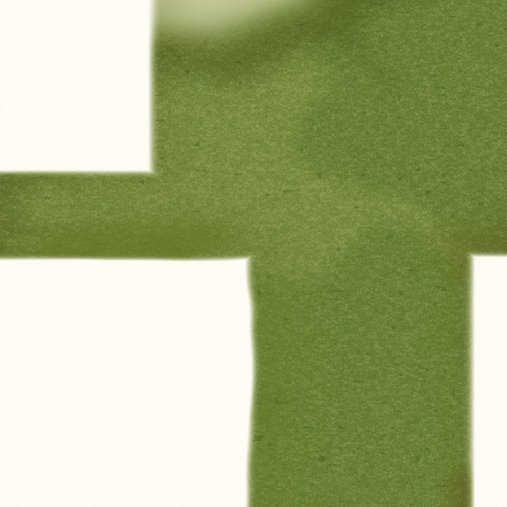
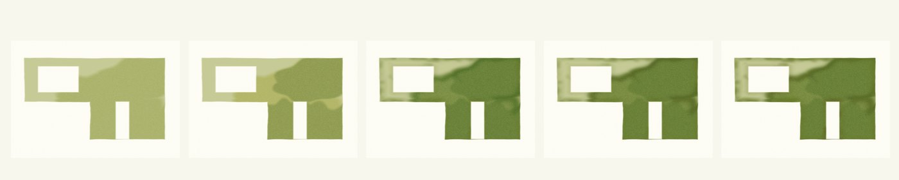

# Northstar grass study (view in the browser)

Stills from the Godot baker on `feat/expert-workspace-ui`. Open this file on
GitHub — the JPEGs render inline. Nothing to download.

This is **not** the live Android canvas. The tablet still uses the Java
rectangle bake. These frames are the presentation target: an L-lawn, house
and path left as paper, living wash fronts inset from the clip.

Guess for a Galaxy Tab S10 FE (10.9" IPS LCD, 2304×1440, 249 ppi, S Pen):
yellow-on-cream dies on LCD, so the lawn is greener and darker than the Java
painter. 2048 matches the panel; the live 1024 cap will look soft under S Pen
zoom. Godot should stay on GLES Compatibility (Xclipse 540).

## Sheet

## Close-ups (S Pen zoom)

## Stages

