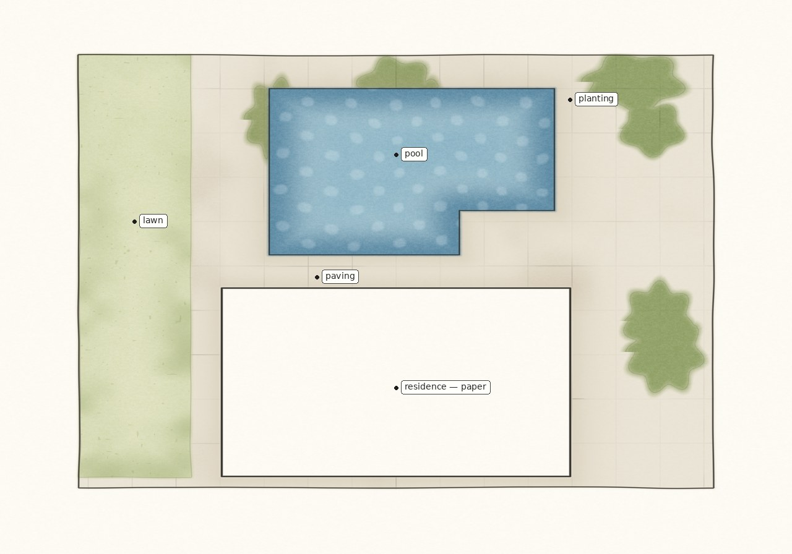
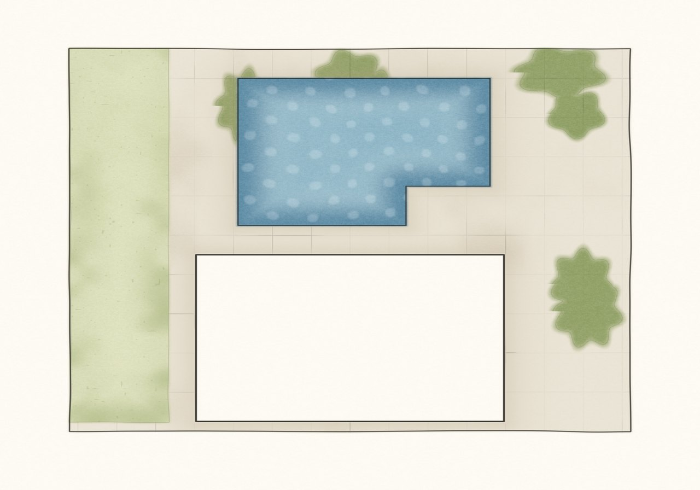
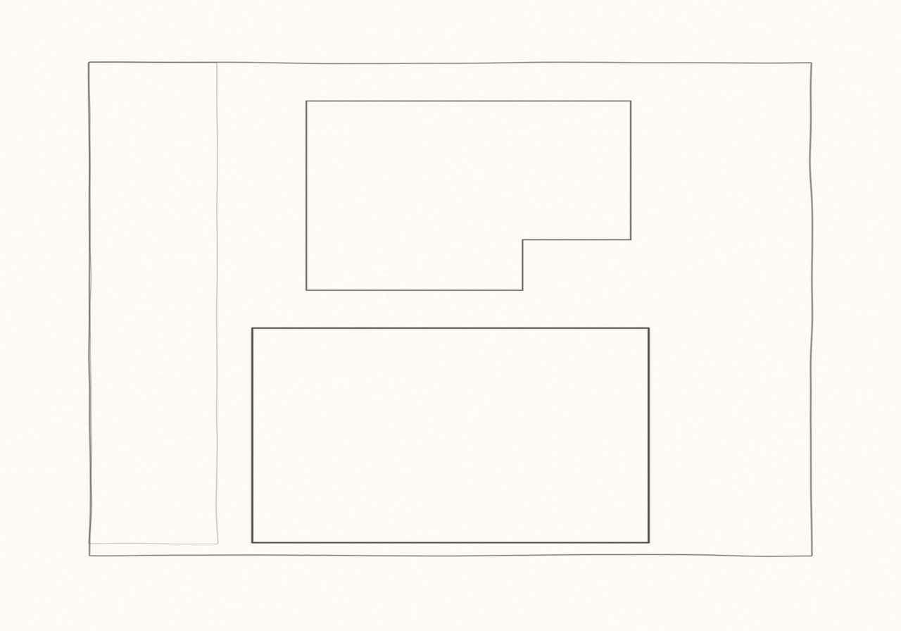
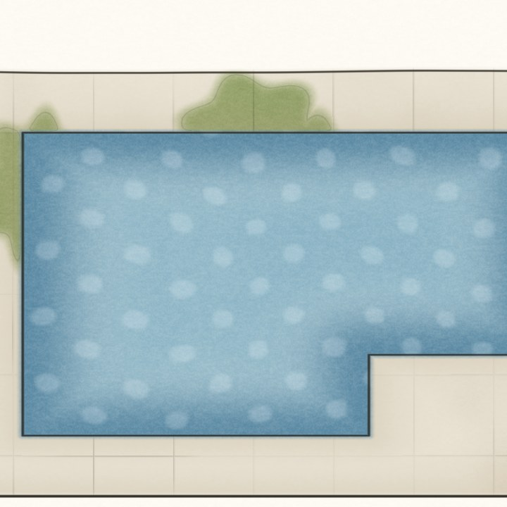
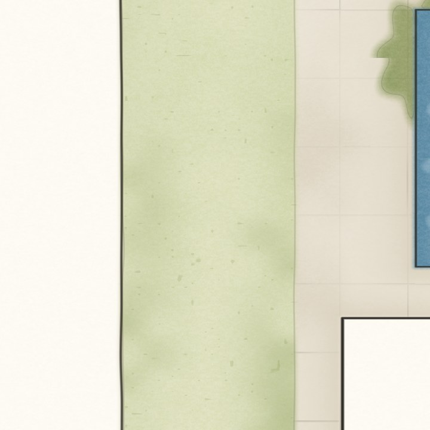
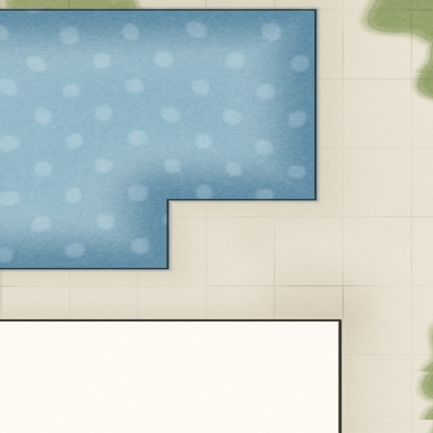
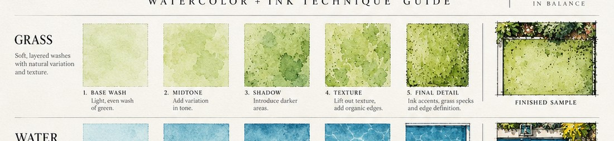
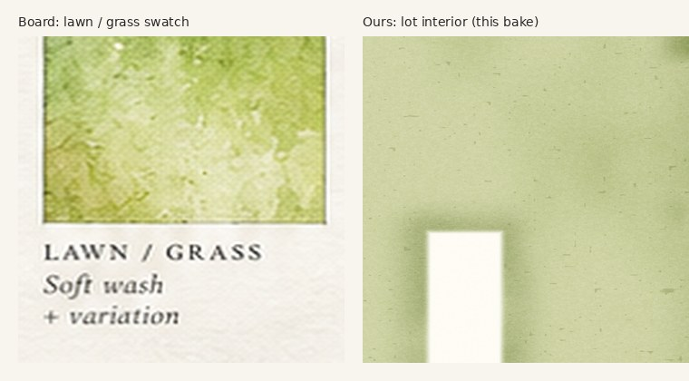

# Northstar plan study (view in the browser)

The boards are a **plan**: ink, pale lawn, water, paving, planting.
This bake is that structure. It is not 9/10 and not on the tablet.

Open this file on GitHub — JPEGs render inline. Nothing to download.

## Plan

## Linework first (board step 1)

## Close-ups

## Grass vs the board

## Stages

