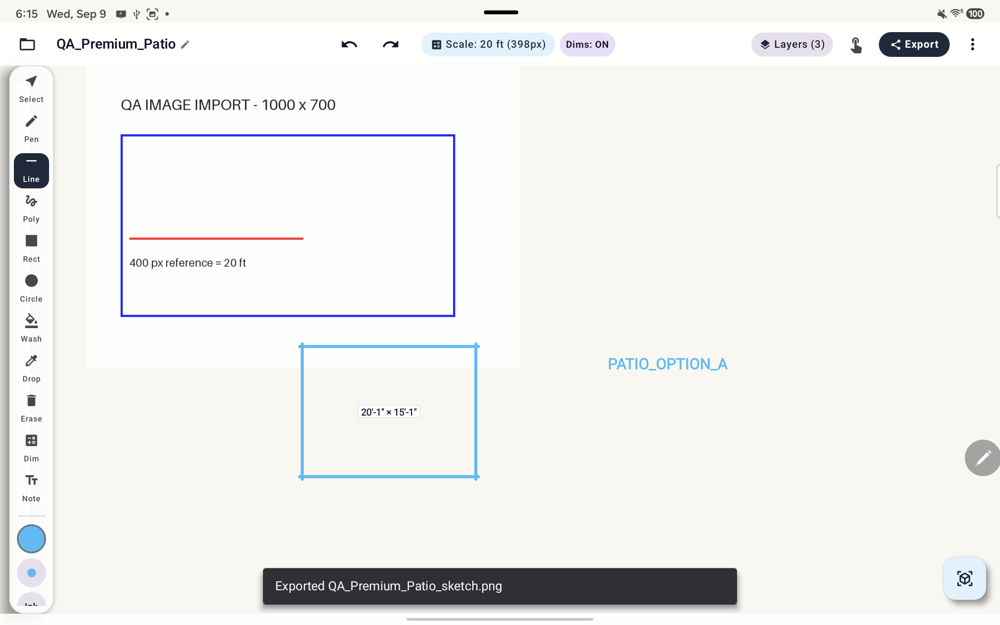
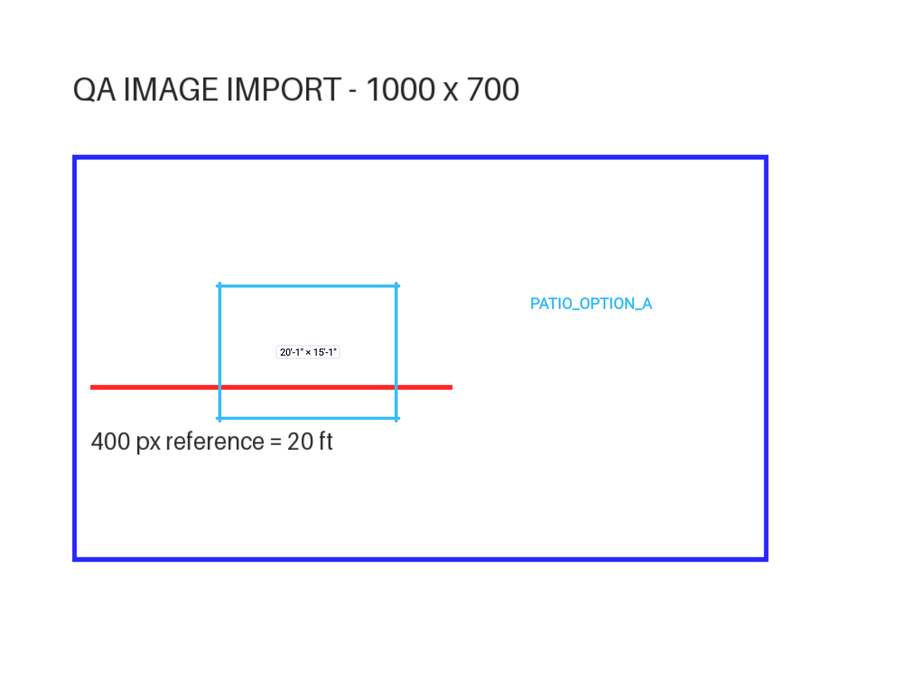

# Plan Trace tablet QA — September 9, 2026

**Useful concept-sketching foundation; not yet dependable for precise editing or client deliverables in this tested build.** All 3D was excluded.

- [Premium workflow audit and roadmap](premium-workflow-audit.md): extended hands-on findings, user expectations, missing/discoverability gaps, acceptance criteria and release gates.
- [Initial functional audit](functional-audit.md): build identity, passing workflows, ten initial findings and reproduction instructions.
- [QA-only model observations](evidence/qa-observations.json): saved geometry and layer history evidence.

The additional pass confirmed export misalignment in both PNG and PDF, incomplete layer-deletion recovery with an orphaned object, and rectangle handles translating rather than resizing. Controlled two-pointer zoom passed without altering saved geometry.

Start with the premium audit. Repair data protection, input routing, undo, calibration and export correctness before expanding features. Existing non-QA projects were unchanged; no application code was modified.

## Visual reproduction: export alignment

On the tablet, the cyan rectangle is below the blue plan boundary. The exported version puts it inside the boundary and across the red reference.

The [PDF](evidence/premium-export.pdf) exhibits the same failure. Import the [generated fixture](evidence/QA_image_plan.png) to reproduce. Its 400-pixel reference represents 20 ft.

## Scope

Samsung Tab S10 FE / Android 16, installed APK version 1.0 (1). See the initial audit for APK hash and package. The local source and APK are not an exact behavioral match. Observations apply to this APK, and source explanations are labeled as leads.

This folder contains selected QA-only evidence. Other raw evidence filenames in the initial report refer to the local audit bundle. Physical S Pen/palm behavior and production-scale stress testing remain open. All proposed premium features are requirements suggestions, not a claim that each was promised or comprehensively tested.
